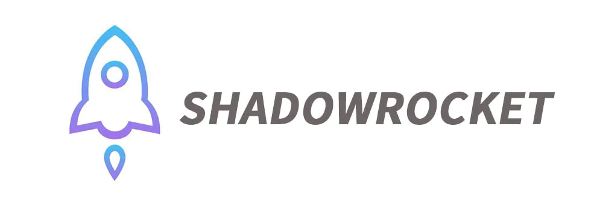

# Shadowrocket Configuration

## Описание
Этот репозиторий содержит конфигурационные файлы для приложения Shadowrocket, которые позволяют настроить VPN подключение для обхода блокировок. Конфигурации позволяют использовать VPN только тогда, когда это необходимо, и прямое подключение в остальных случаях.

**Важно:** Для использования этих конфигураций у вас уже должно быть настроено VPN подключение в Shadowrocket. Конфигурации для VPN подключения в этом репозитории не предоставляются.

## Инструкция по настройке

1. Откройте приложение Shadowrocket и перейдите в раздел `Global Routing` (Config).
2. Выберите для использования режим `Config`. 
3. Перейдите на вкладку `Config`.
4. Нажмите на `+` для добавления новой конфигурации.
5. Введите или вставьте ссылку на готовый конфиг в поле `Download from URL`.

## Доступные конфигурации

1. **Для использования с территории России:** ресурсы, недоступные в РФ, будут открываться при помощи VPN.
   Ссылка на конфигурацию: `https://raw.githubusercontent.com/kschepkin/shadowrocket-configuration/main/configuration-ru.conf`

2. **Для использования за рубежом:** ресурсы, доступ к которым ограничен территорией РФ, будут открываться с использованием VPN.
   Ссылка на конфигурацию: `https://raw.githubusercontent.com/kschepkin/shadowrocket-configuration/main/configuration-non-ru.conf`

## Поддержка и вклад

Если у вас возникли вопросы по настройке или использованию конфигураций, пожалуйста, создайте `Issue` в этом репозитории.

Также я приветствую любой вклад в улучшение конфигураций. Если вы хотите предложить изменения, пожалуйста, сделайте `Fork` репозитория, внесите свои изменения и отправьте `Pull Request`.
